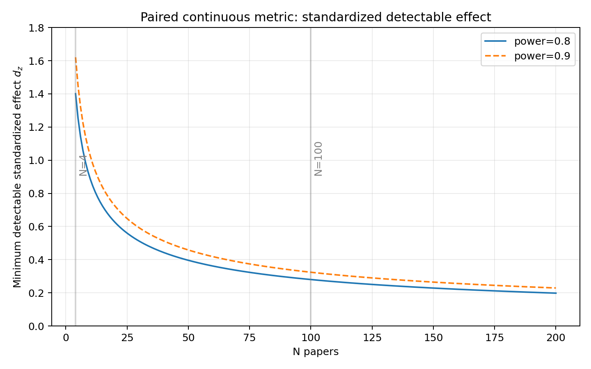
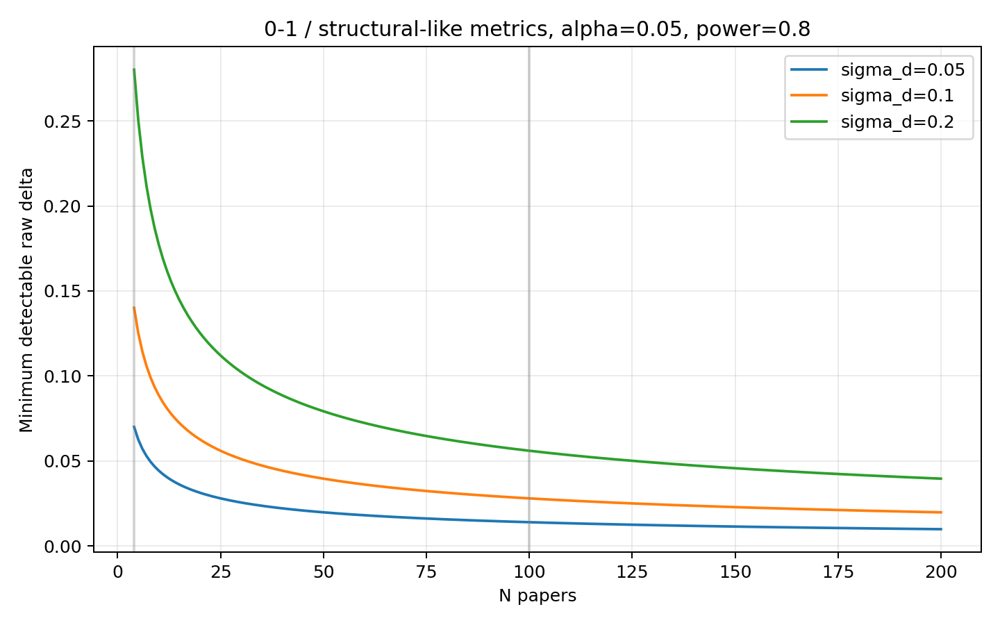
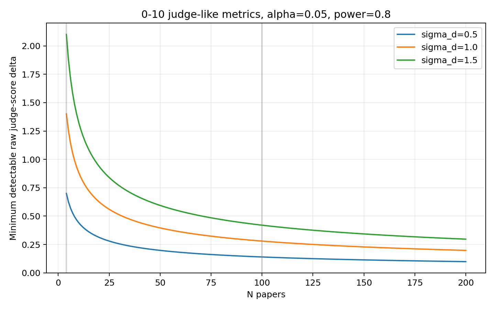
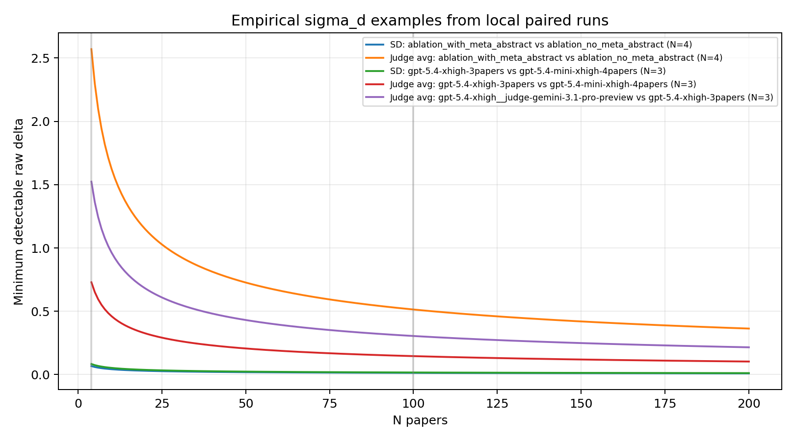
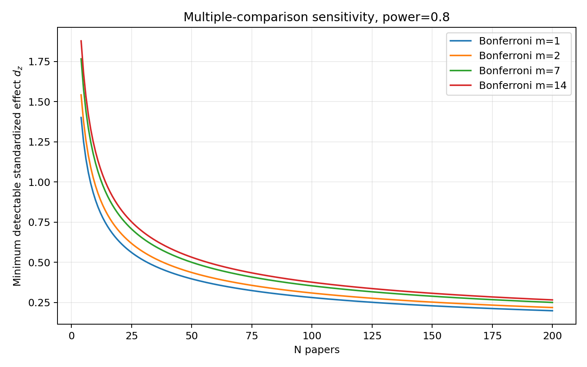

# Outline_COT / MEOW metrics 的 N 與 detectable difference 曲線報告

生成日期：2026-05-20；樣本單位：survey/review paper；主設計：paired comparison。

## Executive summary

- 現行主線 evaluation metric 可以收斂成兩大家族：`Structural Distance` 與 upstream repo-defined `6D LLM-as-a-Judge`。`Reference reward` 是 auxiliary helper，這份主曲線先不納入。
- 對 paired continuous 近似，核心常數是 `z_(1-alpha/2)+z_power`；在 alpha=0.05、power=0.8 時為 `2.802`，power=0.9 時為 `3.242`。
- 只看標準化效果，N=4 時 80% power 需要 `d_z≈1.40`；N=100 時只需要 `d_z≈0.28`。因此 4 篇 paper 只能當 smoke / exploratory signal。
- 對 0-1 的 structural-like metric，如果 paired 差值標準差 `sigma_d=0.10`，N=4 約要 raw Δ=0.140，N=100 約要 raw Δ=0.028。對 0-10 judge average，如果 `sigma_d=1.0`，N=4 約要 1.40 分，N=100 約要 0.28 分。
- 目前 local empirical paired runs 的 N 主要是 3 或 4；可用來畫校準曲線，但不能把這些 sigma 當成穩定母體估計。

## Source-confirmed metric inventory

| Metric | Source / output | Range | Direction | Statistical family | Main curve treatment |
|---|---|---:|---|---|---|
| Structural Distance | `scripts/combine_scores.py`; `scripts/evaluate_chatgpt_meow_blind_batch.py`; `result.structural_distance` | >=0, usually 0-1-ish normalized TED | lower better | paired bounded continuous distance | paired continuous curve; permutation/bootstrap robustness |
| 6D judge dimensions | `prompts/meow_llm_judge_6d_source_user.txt`; `SCORE_KEYS`; `result.judge_scores.*` | 0-10, 0.5 increments allowed | higher better | ordinal bounded score, often approximated continuous | per-dimension paired curve plus ordinal sensitivity |
| Judge average | mean of six judge dimensions in summaries/reporting | 0-10 | higher better | composite bounded continuous | paired continuous curve; note dimension correlation |
| Reference reward | `scripts/ref_reward.py`; `scripts/evaluate_pair_rewards.py` | roughly clipped lower at -1; upper near 1 | higher better | auxiliary ratio/reward helper | excluded from main curves unless promoted |

Structural Distance 是 shape-only：本地 `_build_shape_tree_from_sections` 只使用 section `level` 建樹，節點標籤固定成 `n`，所以 title wording、numbering、ref list、語義內容不會影響該分數。6D judge 的六個維度是：`结构_信息快速定位`、`结构_详略得当`、`内容_章节互斥性`、`内容_逻辑深度`、`内容_学术价值`、`语用_描述性与简洁性`。

## Mathematical core

對同一批 papers 的 paired comparison，令每篇 paper 的差值為 `d_i = y_{B,i} - y_{A,i}`，差值標準差為 `sigma_d`。常態近似下：

```text
Delta_min(N) = (z_{1-alpha/2} + z_power) * sigma_d / sqrt(N)
N_min(Delta) = ((z_{1-alpha/2} + z_power) * sigma_d / Delta)^2
d_z = Delta / sigma_d
```

這是主曲線。對 N 很小的情況，這條曲線偏樂觀；正式推論應搭配 paired permutation、paired bootstrap confidence interval，或明確標成 exploratory。

## Detectable standardized effect

| N papers | d_z at power 0.8 | d_z at power 0.9 |
|---:|---:|---:|
| 4 | 1.401 | 1.621 |
| 10 | 0.886 | 1.025 |
| 25 | 0.560 | 0.648 |
| 50 | 0.396 | 0.458 |
| 100 | 0.280 | 0.324 |
| 200 | 0.198 | 0.229 |

## Empirical paired calibration from current artifacts

以下只用現有 local result artifacts。因為 worktree 很髒，且多數可配對 run 只有 N=3 或 N=4，這些數值只能用來畫 sensitivity / calibration，不應視為穩定母體估計。

本節刻意排除 `gemini-3.1-pro-preview-3papers` 的 judge-average 校準，因為現有 artifact 中該 run 的 judge model 不完全一致；它仍可作 structural distance 參考，但不適合作為乾淨 judge-score variance 估計。

| Pair | Metric | N | Mean diff B-A | SD(diff) |
|---|---|---:|---:|---:|
| `ablation_with_meta_abstract vs ablation_no_meta_abstract` | `structural_distance` | 4 | -0.082 | 0.048 |
| `ablation_with_meta_abstract vs ablation_no_meta_abstract` | `judge_average` | 4 | 0.167 | 1.835 |
| `gpt-5.4-xhigh-3papers vs gpt-5.4-mini-xhigh-4papers` | `structural_distance` | 3 | -0.016 | 0.060 |
| `gpt-5.4-xhigh-3papers vs gpt-5.4-mini-xhigh-4papers` | `judge_average` | 3 | -0.250 | 0.520 |
| `gpt-5.4-xhigh__judge-gemini-3.1-pro-preview vs gpt-5.4-xhigh-3papers` | `structural_distance` | 3 | 0.000 | 0.000 |
| `gpt-5.4-xhigh__judge-gemini-3.1-pro-preview vs gpt-5.4-xhigh-3papers` | `judge_average` | 3 | 0.389 | 1.088 |

## Practical reading

- `Structural Distance`：如果只看 shape distance，0.05 的 raw gap 在 `sigma_d≈0.05` 情境下約需 8 篇；若 `sigma_d≈0.10` 則約需 32 篇；若 `sigma_d≈0.20` 則約需 126 篇。
- `Judge average`：若 paired `sigma_d≈1.0`，要穩定檢出 0.5 分差約需 32 篇；若 `sigma_d≈1.5`，則約需 71 篇。單一 judge dimension 通常比平均分更吵，N 會更高。
- `N=4`：除非效果大到約 `1.4 sigma_d`，否則不要期待顯著。若跑 6 個 judge 維度再加 structural，multiple testing 會讓門檻更高。
- `N=100`：對 moderate effect 已經比較像正式實驗；若 metric 噪音不大，可檢出約 `0.28 sigma_d` 的效果。

## Figures











## Generated artifacts

- `tables/per_paper_metrics.csv`
- `tables/run_summary.csv`
- `tables/paired_comparison_stats.csv`
- `tables/detectable_standardized_effect_by_N.csv`
- `tables/detectable_raw_delta_by_N.csv`
- `tables/required_N_by_target_delta.csv`
- `figures/*.png`
